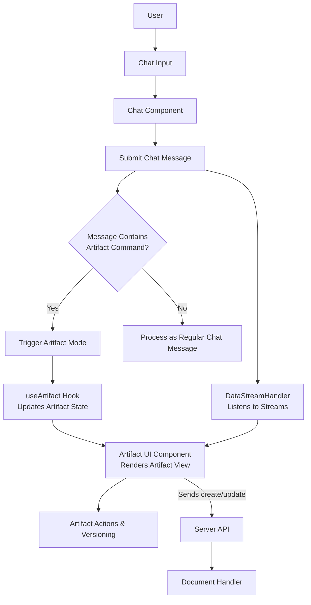

<a href="https://chat.vercel.ai/">
  
  <h1 align="center">Next.js AI Chatbot</h1>
</a>

<p align="center">
  An Open-Source AI Chatbot Template Built With Next.js and the AI SDK by Vercel.
</p>

<p align="center">
  <a href="#features"><strong>Features</strong></a> ·
  <a href="#model-providers"><strong>Model Providers</strong></a> ·
  <a href="#deploy-your-own"><strong>Deploy Your Own</strong></a> ·
  <a href="#running-locally"><strong>Running locally</strong></a>
</p>
<br/>

## Features

- [Next.js](https://nextjs.org) App Router
  - Advanced routing for seamless navigation and performance
  - React Server Components (RSCs) and Server Actions for server-side rendering and increased performance
- [AI SDK](https://sdk.vercel.ai/docs)
  - Unified API for generating text, structured objects, and tool calls with LLMs
  - Hooks for building dynamic chat and generative user interfaces
  - Supports OpenAI (default), Anthropic, Cohere, and other model providers
- [shadcn/ui](https://ui.shadcn.com)
  - Styling with [Tailwind CSS](https://tailwindcss.com)
  - Component primitives from [Radix UI](https://radix-ui.com) for accessibility and flexibility
- Data Persistence
  - [Vercel Postgres powered by Neon](https://vercel.com/storage/postgres) for saving chat history and user data
  - [Vercel Blob](https://vercel.com/storage/blob) for efficient file storage
- [NextAuth.js](https://github.com/nextauthjs/next-auth)
  - Simple and secure authentication

## Model Providers

This template ships with OpenAI `gpt-4o` as the default. However, with the [AI SDK](https://sdk.vercel.ai/docs), you can switch LLM providers to [OpenAI](https://openai.com), [Anthropic](https://anthropic.com), [Cohere](https://cohere.com/), and [many more](https://sdk.vercel.ai/providers/ai-sdk-providers) with just a few lines of code.

## Deploy Your Own

You can deploy your own version of the Next.js AI Chatbot to Vercel with one click:

[](https://vercel.com/new/clone?repository-url=https%3A%2F%2Fgithub.com%2Fvercel%2Fai-chatbot&env=AUTH_SECRET,OPENAI_API_KEY&envDescription=Learn%20more%20about%20how%20to%20get%20the%20API%20Keys%20for%20the%20application&envLink=https%3A%2F%2Fgithub.com%2Fvercel%2Fai-chatbot%2Fblob%2Fmain%2F.env.example&demo-title=AI%20Chatbot&demo-description=An%20Open-Source%20AI%20Chatbot%20Template%20Built%20With%20Next.js%20and%20the%20AI%20SDK%20by%20Vercel.&demo-url=https%3A%2F%2Fchat.vercel.ai&stores=[{%22type%22:%22postgres%22},{%22type%22:%22blob%22}])

## Running locally

You will need to use the environment variables [defined in `.env.example`](.env.example) to run Next.js AI Chatbot. It's recommended you use [Vercel Environment Variables](https://vercel.com/docs/projects/environment-variables) for this, but a `.env` file is all that is necessary.

> Note: You should not commit your `.env` file or it will expose secrets that will allow others to control access to your various OpenAI and authentication provider accounts.

1. Install Vercel CLI: `npm i -g vercel`
2. Link local instance with Vercel and GitHub accounts (creates `.vercel` directory): `vercel link`
3. Download your environment variables: `vercel env pull`

```bash
pnpm install
pnpm dev
```

Your app template should now be running on [localhost:3000](http://localhost:3000/).



```mermaid
graph LR
    A[User interacts with Chat] --> B{AI processes message\n(AI Model & Prompts)}
    B -->|"createDocument" trigger| C[Tool Invocation]
    C --> D[Backend Data Stream\n(DataStreamHandler)]
    D --> E[State Update\n(useArtifact Hook)]
    E --> F[Render Artifact UI\n(Artifact Component)]
    F -->|sets isVisible=true| G[[Artifact Panel]]
    H[Document Preview Click] --> G

    subgraph Artifact_Creation_Flow["Artifact Creation Flow"]
        B --> C --> D --> E --> F
    end

    subgraph Visibility_Trigger["Visibility Triggers"]
        F --> G
        H --> G
    end

    style G fill:#f9f,stroke:#333,stroke-width:2px
    classDef artifactFlow fill:#e6f4ea,stroke:#0fa37f
    classDef visibilityTrigger fill:#fae6e6,stroke:#dc2626
    class Artifact_Creation_Flow artifactFlow
    class Visibility_Trigger visibilityTrigger
```
