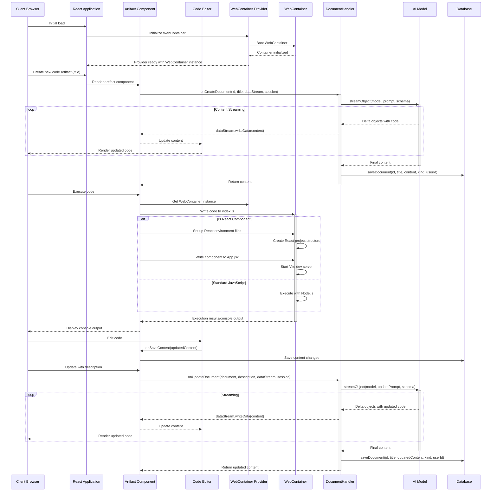

```mermaid
sequenceDiagram
    participant Client as Client Browser
    participant ReactApp as React Application
    participant ArtifactComp as Artifact Component
    participant CodeEditor as Code Editor
    participant WebProvider as WebContainer Provider
    participant WebContainer as WebContainer
    participant Handler as DocumentHandler
    participant AI as AI Model
    participant DB as Database

    %% Initialization flow
    Client->>ReactApp: Initial load
    ReactApp->>WebProvider: Initialize WebContainer
    WebProvider->>WebContainer: Boot WebContainer
    WebContainer-->>WebProvider: Container initialized
    WebProvider-->>ReactApp: Provider ready with WebContainer instance

    %% Creation Flow
    Client->>ReactApp: Create new code artifact (title)
    ReactApp->>ArtifactComp: Render artifact component
    ArtifactComp->>+Handler: onCreateDocument(id, title, dataStream, session)
    Handler->>+AI: streamObject(model, prompt, schema)

    loop Content Streaming
        AI-->>Handler: Delta objects with code
        Handler-->>ArtifactComp: dataStream.writeData(content)
        ArtifactComp-->>CodeEditor: Update content
        CodeEditor-->>Client: Render updated code
    end

    AI-->>-Handler: Final content
    Handler->>DB: saveDocument(id, title, content, kind, userId)
    Handler-->>-ArtifactComp: Return content

    %% Code Execution Flow
    Client->>ArtifactComp: Execute code
    ArtifactComp->>WebProvider: Get WebContainer instance
    ArtifactComp->>+WebContainer: Write code to index.js

    alt Is React Component
        ArtifactComp->>WebContainer: Set up React environment files
        WebContainer->>WebContainer: Create React project structure
        ArtifactComp->>WebContainer: Write component to App.jsx
        WebContainer->>WebContainer: Start Vite dev server
    else Standard JavaScript
        WebContainer->>WebContainer: Execute with Node.js
    end

    WebContainer-->>-ArtifactComp: Execution results/console output
    ArtifactComp-->>Client: Display console output

    %% Editing Flow
    Client->>CodeEditor: Edit code
    CodeEditor->>ArtifactComp: onSaveContent(updatedContent)
    ArtifactComp->>DB: Save content changes

    %% AI-Assisted Updates
    Client->>ArtifactComp: Update with description
    ArtifactComp->>+Handler: onUpdateDocument(document, description, dataStream, session)
    Handler->>+AI: streamObject(model, updatePrompt, schema)

    loop Streaming
        AI-->>Handler: Delta objects with updated code
        Handler-->>ArtifactComp: dataStream.writeData(content)
        ArtifactComp-->>CodeEditor: Update content
        CodeEditor-->>Client: Render updated code
    end

    AI-->>-Handler: Final content
    Handler->>DB: saveDocument(id, title, updatedContent, kind, userId)
    Handler-->>-ArtifactComp: Return updated content
```
