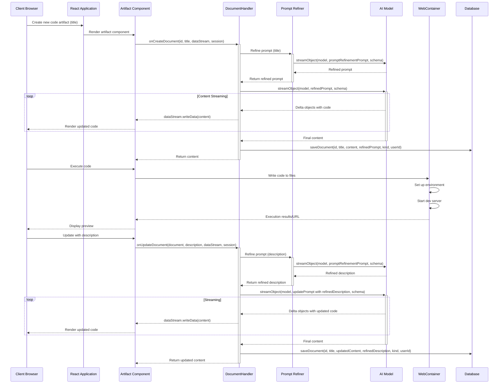

# Prompt Refinement Flow

This document outlines the implementation of hidden prompting steps to refine the output of code editing. The process includes improving user prompts, adding features for incomplete specifications, and fixing formatting issues.

## Updated Flow Diagram

## Implementation Details

1. **Prompt Refinement Process**:

   - When a user provides a title or update description, it's sent to a prompt refinement step
   - The refinement process improves the prompt by adding missing features, fixing formatting, and adding technical details
   - The refined prompt is then used for code generation, resulting in better quality output

2. **Database Changes**:

   - Added a `refined_prompt` column to the `Document` table to store the refined prompts
   - This allows for traceability between the original user prompt and the refined version

3. **Code Flow**:

   - The `refinePrompt` function in `lib/ai/promptRefiner.ts` handles the prompt refinement
   - Both document creation and update processes now include the refinement step
   - The refined prompt is passed to the AI model for code generation
   - The system stores both the generated code and the refined prompt

4. **Benefits**:
   - Improved code quality through better prompts
   - More consistent output with standardized formatting
   - Addition of expected features that users might not have explicitly mentioned
   - Better handling of vague or incomplete specifications
